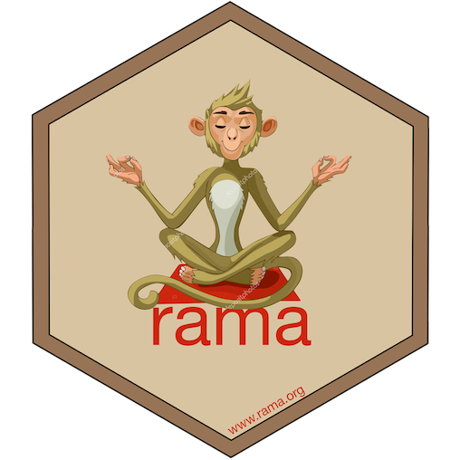

<!-- README.md is generated from README.Rmd. Please edit that file -->

```{r, echo = FALSE}
knitr::opts_chunk$set(
  collapse = TRUE,
  comment = "#>",
  fig.path = "README-"
)
```

# rama 

<!-- [](https://cran.r-project.org/package=rama) -->

`rama` is an R interface to the [GAMA](https://gama-platform.github.io)
agent-based simulation platform.

## Installation

You can install `rama` from GitHub with:

```{r gh-installation, eval = FALSE}
# install.packages("devtools")
devtools::install_github("r-and-gama/rama")
```

