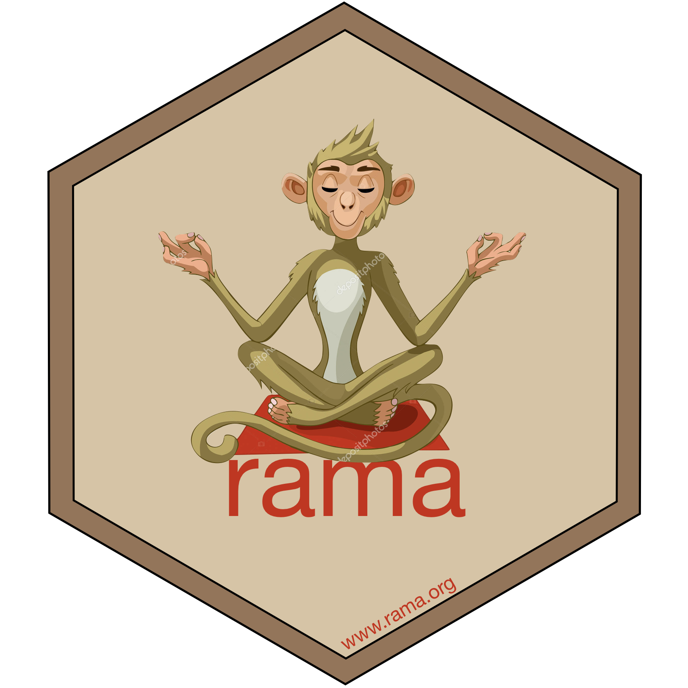

<!-- README.md is generated from README.Rmd. Please edit that file -->
`rama` 
================================================================

[](https://cran.r-project.org/package=rama)

`rama` is an R interface to the [GAMA](https://gama-platform.github.io) agent-based simulation platform. It allows to

-   **read** an experiment of a model defined in a `.gaml` file,
-   **manipulate** this experiment, including generate experiment plans and
-   **run** the simulations defined in an experiment plan.

An **experiment** is a group of simulations. A **simulation** is an execution of a given **model** with

-   a given set of **parameters values**,
-   a given set of **observed variables**,
-   a **duration** of simulation and
-   a **seed** value.

All the simulations of an experiment relate to the same model. In R, an experiment belongs to the class `experiment` that is an extension of the class `data.frame`. The creation and manipulation of experiments can thus efficiently be performed with all the `data.frame` methods. The class `experiment` is also [tidyverse](https://www.tidyverse.org)-compliant, which allows its insertion in **pipelines** (or workflows). Outputs of `experiment` runs is an object of class `experiment` too, with fields corresponding to the simulation outputs, typically data frames of time series of observed variables and / or links to snapshots that can subsequently assembled into movies. The R environment allows to

-   create **experimental designs** (for example with the [expand.grid()](https://www.rdocumentation.org/packages/base/versions/3.5.1/topics/expand.grid) function),
-   **statistically explore** results of simulation (typically looking at how the parameters values influenced the dynamics of the state variables),
-   perform **sensitivity analysis** of model's parameters (how much each parameter quantitatively influences the outputs),
-   **estimate parameters values** (model calibration) if real data are available for the model' state variables.

An object of class `experiment` contains, in addition to above-mentionned data frame, a hard link to a `.gaml` file containing the GAML model (**input**) and a hard link to a folder containing the **outputs** of simulations. These links are not supposed to be modified by the user. The `.gaml` file is not supposed either to be modified by the user in R. Instead, the GAML model should be developed in the [GAMA](https://gama-platform.github.io) software. The use of `rama` should be restricted to the design and exploitation of experiments' simulations as outlined above.

`experiment` class
------------------

The unique class of `rama` is `experiment`. It is basically a data frame structured this way:

Installation and configuration
------------------------------

You can install `rama` from GitHub with:

``` r
installed_packages <- row.names(installed.packages())
if (! "devtools" %in% installed_packages) install.packages("devtools")
if (! "rama" %in% installed_packages) devtools::install_github("r-and-gama/rama")
```

After loading, `rama` needs to be configured, a step that basically consists in linking `rama` to a GAMA engine on the system:

``` r
setup()
```

If GAMA is not installed on the system, it can be installed directly from R as

``` r
install_gama()
```
